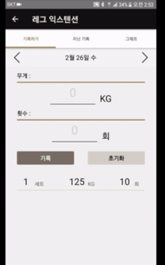
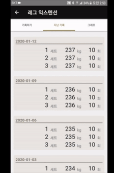
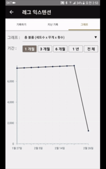

# 파워로그

가장 간단한 운동 일지 작성 애플리케이션

## 소개

헬스를 좋아합니다. 운동을 하면 할 수록 기록이 꼭 필요하다는 것을 알게 되었죠.
여러가지 운동 기록 앱을 써봤으나 복잡하고 답답하더군요.
그저 기록하고 확인하고 싶을 뿐인데 어떻게 써야하는지 따로 공부해야 할 정도니까요.
그래서 만들었습니다.
간단합니다. 기록하세요.
보여 드릴게요.

## 기능

### 카카오로 로그인하기

### 나만의 운동 등록하기

### 운동 기록하기

### 운동 기록 확인하기
- 지난 운동 기록 보기

- 운동 능력 성장 그래프 보기

